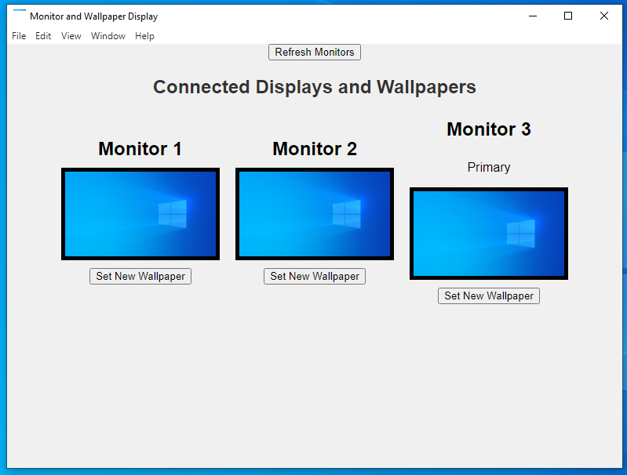

# Wallpaper Manager

## Description
Wallpaper Manager is an Electron application that allows users to manage multi-window wallpapers with ease. It provides functionality to set wallpapers for multiple monitors and create composite wallpapers.

## Preview


## Features
- Get and set wallpapers for connected monitors.
- Create transcoded image files for better compatibility.
- Manage wallpapers with a user-friendly interface.

## Installation

1. Clone the repository:
   ```bash
   git clone https://github.com/wildpoptart/windowsWallpaper.git
   cd windowswallpaper
   ```

2. Install dependencies:
   ```bash
   npm install
   ```

3. Build the application:
   ```bash
   npm run build
   ```

4. Run the application:
   ```bash
   npm start
   ```

## Usage
- Launch the application.
- Select the monitor you want to change the wallpaper for.
- Choose a new image from your files.
- The application will update the wallpaper accordingly.

## Contributing
Contributions are welcome! Please open an issue or submit a pull request.

## License
Do whatever you want with this.

## Acknowledgments
- [Electron](https://www.electronjs.org/) for building cross-platform desktop apps.
- [Sharp](https://sharp.pixelplumbing.com/) for image processing.