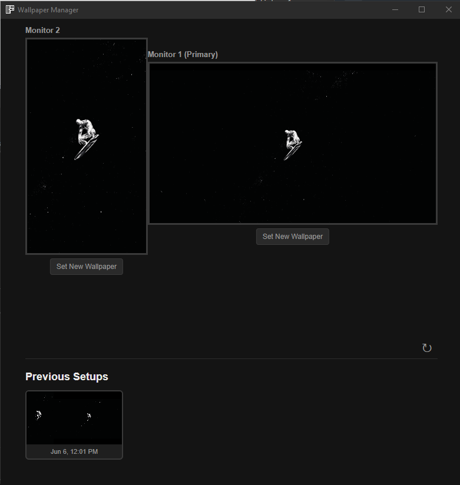

# Wallpaper Manager

## Description
Wallpaper Manager is an app that allows users to manage multi-window wallpapers with ease. It provides functionality to set wallpapers for multiple monitors and create composite wallpapers.

## Preview

## Features
- Get and set wallpapers for connected monitors.
- Create transcoded image files for better compatibility.
- Manage wallpapers with a user-friendly interface.